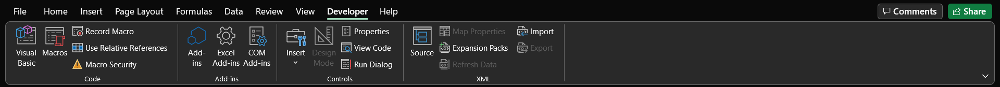
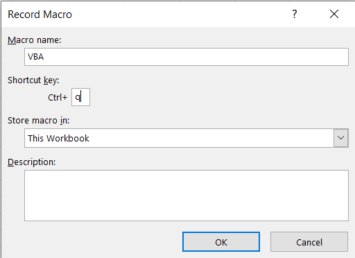
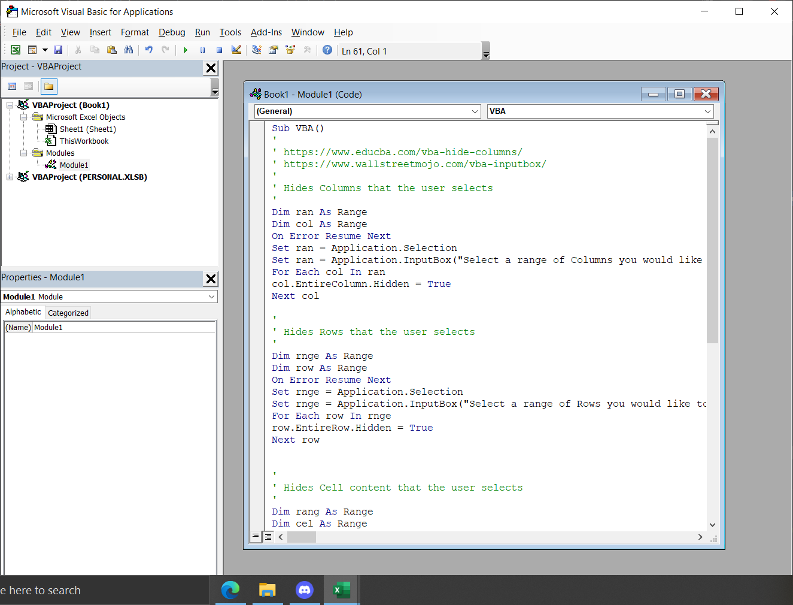

# VBA Macros
## Cora Wagner

[Access VBA Code](https://github.com/CoraWagner/VBA/blob/9243797c50da243d44a5114c495b6160db2f0dd4/MacrosCode)

### How to use the macro
1. Copy the code from the GitHub link above.
2. Open Excel and create a new file, or open an existing file you would like to use the macro on.
3. Go to the *Developer* tab at the top of the Excel Workbook. 

4. Select *Record Macro* under the *Code* subsection. Name your macro and create a shortcut key combination. Select *Okay*. 
5. Select *Stop Recording* where the *Record Macro* button was previously.
6. Select *Macros* under the *Code* subsecction. A VBA page will pop-up.
7. Paste the GitHub macro code in text box and save the macro. 
8. You can now run the macro by using the shortcut key you created, or by selecting *Macro* and double clicking the name you created for the macro.

### How the macro works
#### Delete Columns
The first section of my Macro made in VBA is:

`Dim ran As range`

`Dim col As range`

`On Error Resume Next`

`Set ran = Application.Selection`

`Set ran = Application.InputBox("Select a range of Columns you would like to hide.", "Hide Columns", ran.Address, Type:=8)`

`For Each col In ran`

`col.EntireColumn.Delete`

`Next col`

This block of code allows the user to selects the specific range of columns that they would like to delete. This is possible by setting the `ran` range to `Application.Selection` and then `Application.InputBox("Select a range of Columns you would like to hide.", "Hide Columns", ran.Address, Type:=8)`. 

The parameters in `Application.InputBox()` are:
1. The main message of the pop-up box
2. The main title of the pop-up box
3. The location of the cells being selected
4. The type that is being selected

In this case, the type being selected is a cell reference. There is then a for loop that iterates through all the selected cells and deletes the entire column. 

**NOTE**: In order to delete the entire column, you need to highlight the entire column. Not just a single cell.

#### Delete Rows
The second section of the macro is:

`Dim rnge As range`

`Dim row As range`

`On Error Resume Next`

`Set rnge = Application.Selection`

`Set rnge = Application.InputBox("Select a range of Rows you would like to hide.", "Hide Rows", rnge.Address, Type:=8)`

`For Each row In rnge`

`row.EntireRow.Delete`

`Next row`

This block of code is similar to *delete Columns* section as it allows the user to select which rows they would like to remove. The only difference, besides the variable names, is that instead of `EntireColumn` it is `EntireRow`.

**NOTE**: In order to delete the entire row, you need to highlight the entire row. Not just a single cell.

#### Remove Unwanted Hyperlinks
The third section of the macro is:

`Dim rng As range, cell As range`

`Dim xLink As Hyperlink`

`Set rng = Application.Selection`

`Set rng = Application.InputBox("Select a range of Hyperlinks you would like to remove.", "Remove Hyperlinks", rng.Address, Type:=8)`

`For Each cell In rng`

`cell.Select`

`ActiveCell.Font.ColorIndex = 1`

`ActiveCell.Font.Underline = False`

`ActiveCell.Interior.ColorIndex = -4142`

`ActiveCell.ClearHyperlinks`

`Next cell`

As in the preveious sections, the user can select which cells they would like the hyperlinks to be removed from. The text is then changed to black, the undeline is removed, and the background color is set back to default. Then the hyperlink is cleared from the cell.

#### Clear Cell Content
The forth section of the macro is:

`Dim rang As range`

`Dim cel As range`

`On Error Resume Next`

`Set rang = Application.Selection`

`Set rang = Application.InputBox("Select a range of Cells you would like to hide.", "Hide Cells", rang.Address, Type:=8)`

`For Each cel In rang`

`cel.Select`

`ActiveCell.ClearContent`

`Next cel`

Like the previous sections, the user is able to select the cells that they want the contents to be removed from. The way that the content is removed is by using the function `ClearContent`.

#### Format a Table in Markdown
The last section of the macro is:

`Dim r As Range`

`Dim newFile As String`

`newFile = Application.DefaultFilePath & "\VBA+Macros.txt"`

`On Error Resume Next`

`Set r = Application.Selection`

`Set r = Application.InputBox("Select a range of cells you would like to turn into a table.", "Make Table", r.Address, Type:=8)`

`Open newFile For Output As #1`

`For i = 1 To r.Rows.Count`

`For j = 1 To r.Columns.Count`

`If j = r.Columns.Count Then`

`Print #1, "|"; r.Cells(i, j).Value; "|"`

`Else`

`Print #1, "|"; r.Cells(i, j).Value;`

`End If`

`Next j`

`Next i`

`Close #1`

This section of code creates a new file for the macro to print to. It saves it to the users default file path and names the file *VBA+Macros.txt*. It then allows the user to select the range of cells that they would like converted into a markdown table. It then loops through each selected cell and prints the cell values to the new file while including specific formating guidelines for a markdown table. Once the maacro finishes running, the user can access the saved file.

### Example Of a Table Cleaned-up with the Macro
To build the table, the user needs to copy the text file and paste it into the markdown editor on GitHub. Now the user can view a table on their website.
															
|Day|Topic|Due|
|1|[What is Data Science ](https://docs.google.com/document/d/1yhVB9DfddvJIiXitX2ZC1W0D3cJbcvib5fWmUlgqNO0/edit)||
|2|[VBA](https://docs.google.com/document/d/1ASoeI5CjFgyQTBm-HFPvmRC_94niTPx4s9crQEDVb10/edit)|[HW1 - Excel](https://docs.google.com/document/d/1g8eOYNe9sDmrstRgvFRZBskxjaIaD7Za4lFXSgPPkVw/edit)|
|3|[Data Communication](https://docs.google.com/document/d/1PTe_eezbRdZcxIOODyiQzDM4vtjVNJkVDC_7vZQSoZE/edit)||
|4|Work Day|[HW2 - VBA](https://docs.google.com/document/d/1bTkmUon_Kq6_DupNw2Szh-T4rFGqzeA2aIIBy7m1yhk/edit)|
|5|Why are data visualizations important ?|[Reading Due - Florence Nightengale](https://docs.google.com/forms/d/1FBgScIpV9Vpa-jb1nlWuoCqOxFE7v5SmQtacpFHpIq8/edit)|
|6|Tableau|[COVID Risk Calculator](https://www.nytimes.com/2021/12/30/style/covid-risk-calculator.html)|
|7|How visualizations lie|Reading Due - Differnet Kinds of Data Visualization|
|8|Work Day|HW 3 - Tableau|
|9|Danielle|Reading Due - How Charts Lie|
|10|R Intro||
|11|[Doing Better Data Visualization (R and ggplots tutorisl)](https://github.com/arielcwebster/DataScience/blob/main/Doing Better Data Visualization _ Enhanced Reader.pdf)|[Why Data is good for governments to provide](https://www.theguardian.com/local-government-network/2013/oct/21/open-data-us-san-francisco)|
|12|Work Day|HW 4 - ggplots|
|13|Sentiment Analysis - History and Types|Data Annonymity|
|14|TextBlob|[Reading Due - How to un annonymize data](https://www.theguardian.com/technology/2019/jul/23/anonymised-data-never-be-anonymous-enough-study-finds)|
|15|VADER|[De-Annonymizing Data](https://www.nature.com/articles/s41467-019-10933-3)|
|16|[P-Hacking Reflection](https://rss.onlinelibrary.wiley.com/doi/epdf/10.1111/1740-9713.01505)|HW 5 - Sentiment Analysis|
|Spring Break|||
||||
|17|Random Forest||
|18|||
|Advising Day|||
|19||HW 6 - Random Forest|
|20|Clustering - K Nearest Neighbors||
|21||[Possible Reading - Proxy Discrimination - When AI find predictive proxies for race - because society is segregated in this way. ](https://ilr.law.uiowa.edu/print/volume-105-issue-3/proxy-discrimination-in-the-age-of-artificial-intelligence-and-big-data)|
|22|||
|23||HW 6 - Clustering|
|24|Final Project||
|25|||
|26|||
|27|||							

### Works Cited

[InputBox](https://www.wallstreetmojo.com/vba-inputbox/)

[Remove Underline](https://software-solutions-online.com/excel-vba-underline-font-style/)

[Change Font Color](https://www.educba.com/vba-font-color/)

[Clear Hyperlinks](https://www.extendoffice.com/documents/excel/2221-excel-remove-hyperlink-without-removing-formatting.html#:~:text=In%20Excel%2C%20there%20is%20no%20direct%20way%20to,open%20the%20Microsoft%20Visual%20Basic%20for%20Applications%20window.)

[Write to Text File](https://www.excel-easy.com/vba/examples/write-data-to-text-file.html)

[Extract URL from Hyperlink](https://spreadsheetplanet.com/extract-url-from-hyperlinks-excel/#:~:text=Extract%20URL%20from%20Hyperlinks%20Using%20Formula.%201%20Open,a%20Module%20to%20the%20workbook%20objects.%20More%20items)

[Print to Text File](https://analysistabs.com/vba/vba-write-string-text-file-without-quotes/#:~:text=Starting%20the%20program%20and%20sub%20procedure%20to%20write,text%20file%20for%20Output%20with%20FileNumber%20as%201.)
